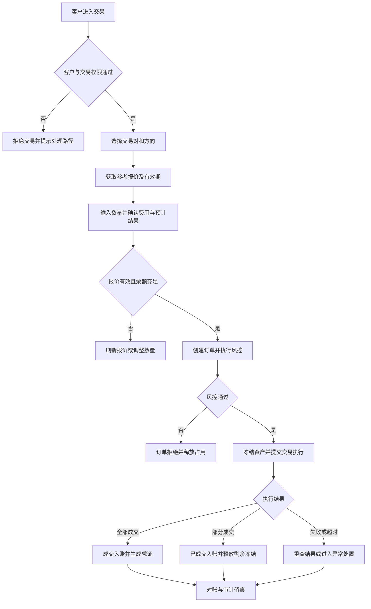
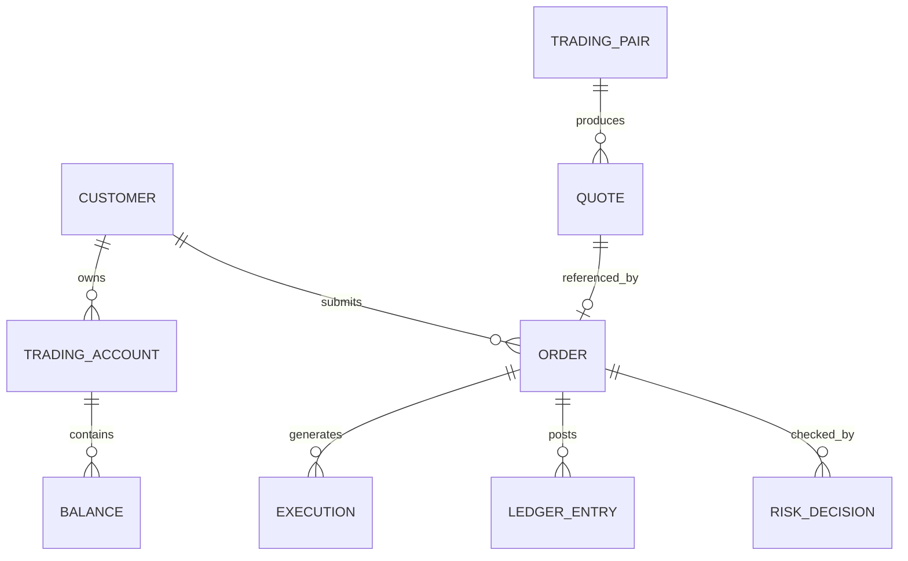
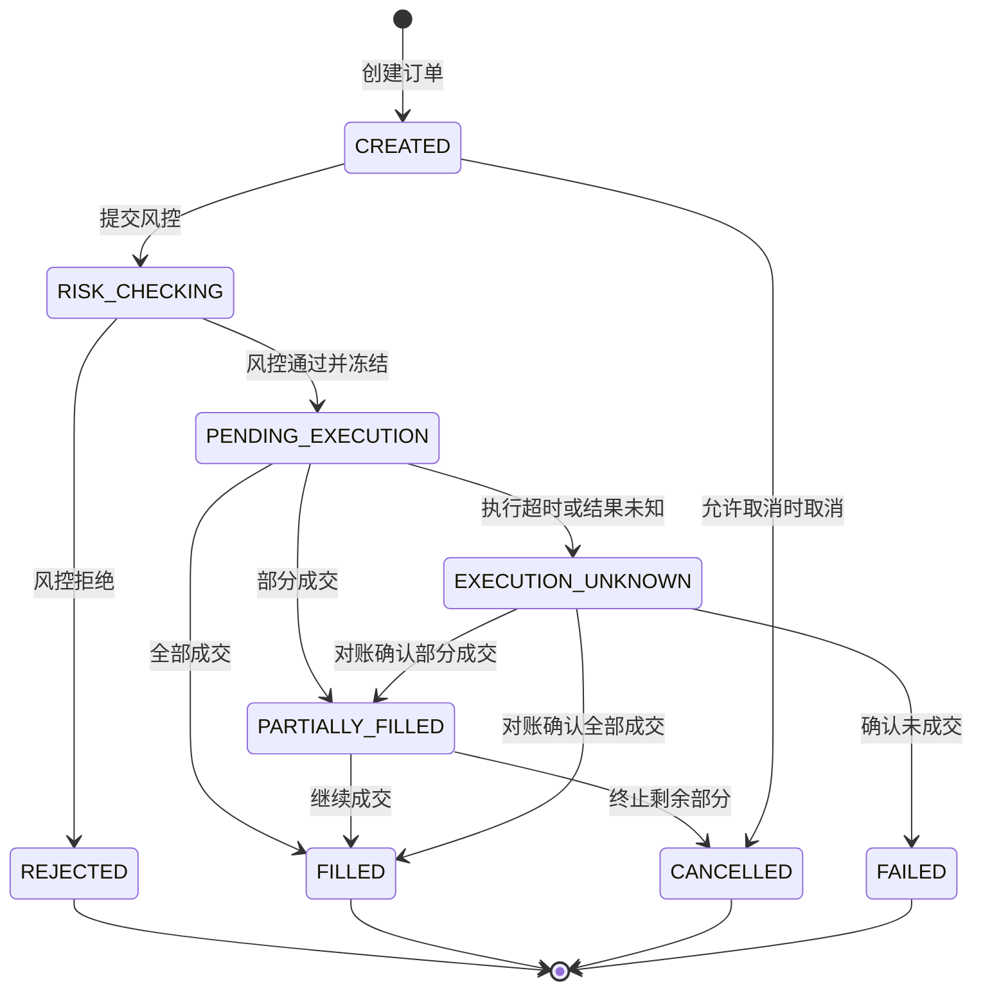

# 【数字货币交易】20260830-数字货币现货交易能力建设

- 飞书项目链接：[待确认：飞书项目链接]
- 一句话需求说明：为符合准入条件的客户提供可审计、可风控、资金与资产账务一致的数字货币现货交易能力。
- 原始需求：生成一个数字货币交易的产品文档

## 1. 文档变更日志

| 时间 | 版本号 | 变更人 | 主要变更内容 |
| --- | --- | --- | --- |
| 2026-08-30 | V1.0 | [待确认：产品负责人] | 创建数字货币交易需求文档初稿 |

## 2. 需求分析

### 2.1 需求背景

- 业务场景：客户在跨境收付、资金归集或数字资产管理过程中，可能需要在获准的资产之间进行兑换或交易。
- 触发背景：当前仅收到“生成数字货币交易产品文档”的需求，具体提出方、目标市场、存量流程和业务规模尚未提供。
- 外部约束：数字货币交易涉及牌照范围、客户准入、KYC/KYB、AML、制裁筛查、Travel Rule、资产托管、数据留存和税务等要求，必须按实际经营司法辖区完成合规评估后才能上线。
- 产品定位：[待确认：本产品是交易平台、经纪撮合、询报价兑换，还是连接外部持牌交易执行方的技术服务]
- 设计基线：为形成可评审初稿，本文按“面向已完成准入客户的数字货币现货交易 MVP”展开；该范围属于建议方案，不代表已确认的业务结论。

### 2.2 现状问题

- [待确认：当前是否已有数字货币钱包、报价、兑换、订单、账务和对账能力]
- 客户可能需要在多个系统或线下渠道完成询价、确认、资产划转和凭证核对，操作链路缺乏统一入口。
- 若订单、成交、钱包资产和资金账务由不同系统维护，容易出现状态不一致、重复执行、冻结未释放和差错难追溯等问题。
- 若交易前未统一执行客户准入、币种准入、地址风险、额度和制裁校验，可能形成合规与资金风险敞口。
- 缺少统一订单号、成交记录、费用明细、状态轨迹和审计日志时，客户服务、运营、财务与风控难以共同定位问题。
- 上述问题影响的客户类型、频次、金额和人工成本均待调研：[待确认：现状数据与基线指标]

### 2.3 解决思路

建议建设一条受控的数字货币现货交易链路：客户完成准入后查看可交易资产和参考报价，提交交易意向，系统在交易前完成风控与余额校验并冻结必要资产，随后向已确认的交易执行方提交订单；成交后统一更新订单、成交、资产账务与费用，未成交部分及时解冻，并向客户提供结果和可下载凭证。

关键边界：

- 交易模式、交易执行方、托管方、定价方式、费用承担和资金清结算方式必须在方案评审前确认。
- 客户看到的参考报价与最终成交价必须明确区分；报价有效期、价格保护和滑点规则必须可解释。
- 所有资金或资产变更必须具备幂等、防重、账务一致性、日终对账、自检自控和异常补偿能力。
- 风控拒绝、余额不足、报价过期、部分成交、执行超时和对账不平必须有独立状态与恢复路径。

建议首期不处理：

- 杠杆、保证金、永续合约、期权、借贷、质押及其他衍生品。
- 自营做市和未对冲风险敞口。
- 法币充值、提现与银行卡收单能力；如确需纳入，应作为独立需求评审。
- 面向匿名客户或未完成准入客户的交易。
- 未经法务与合规确认的国家/地区、客户类型、资产和交易对。

### 2.4 价值评估

#### 给商户带来的价值

- 在统一入口完成报价查看、交易提交、状态跟踪和成交凭证获取，降低跨系统操作成本。
- 通过清晰的报价有效期、费用、预计到账和失败原因，提高交易决策透明度。
- 通过订单与成交记录追溯资产变化，便于财务核对和内部审计。
- 量化价值待确认：[待确认：目标客户数、月交易笔数、月交易额、操作时长下降比例]

#### 给易宝带来的价值

- 形成可配置的数字资产交易基础能力，为跨境支付和数字资产服务提供组合空间。
- 将准入、风控、订单、账务和对账纳入统一治理，降低线下操作与差错处理成本。
- 沉淀交易量、成交率、失败原因和风险命中等运营数据，为产品优化与合规审计提供依据。
- 收益模型待确认：[待确认：点差、手续费、服务费或其他收费模式及预期收入]

### 2.5 需求范围

本期建议范围：

- 客户与交易权限校验。
- 可交易资产、交易对和交易规则展示。
- 参考报价获取、报价有效期提示和报价刷新。
- 现货买入/卖出订单提交、二次确认与防重复提交。
- 余额校验、资产冻结、风控决策和订单执行。
- 全部成交、部分成交、失败、撤销或超时等状态跟踪。
- 成交入账、费用记录、未成交资产解冻、订单详情和交易凭证。
- 运营查询、人工复核、异常处置、对账和审计日志。

不在本期范围：

- 杠杆及衍生品交易。
- 自建公开订单簿、撮合引擎或面向社会公众的交易所能力，除非业务模式另行确认。
- 法币出入金、钱包地址管理和链上充提的完整建设；本需求仅定义与交易链路的依赖关系。
- 自动化税务申报和会计记账规则落地：[待确认：是否另立需求]

受影响系统：

- YiPex 客户端/商户端：[待确认：实际应用名称]
- YiPex 运营后台：[待确认：实际应用名称]
- 客户与权限系统、账户账务系统、钱包/托管系统、风控系统、清结算与对账系统。
- 外部行情、流动性、交易执行或托管服务：[待确认：供应商及接入模式]

## 3. 目标

### 3.1 设计目标

- 可用性：符合准入条件的客户能够完成“选交易对—获取报价—确认交易—查看结果”的闭环；不符合条件时获得明确且不泄露敏感策略的原因与下一步。
- 正确性：同一业务请求不得重复扣减、重复冻结或重复入账；订单、成交、资产账务和费用记录可通过同一业务编号核对。
- 可恢复性：报价过期、执行超时、部分成交、回调重复、网络中断和对账不平时具有明确的重试、补偿、解冻或人工处置路径。
- 可审计性：关键决策、状态变化、操作者、请求标识、风险结果、账务流水和外部响应可追溯，留存期限按合规要求配置。
- 性能：[待确认：报价接口与下单接口的 P95/P99 响应时间、峰值 TPS 和并发客户数]
- 质量：[待确认：目标成交成功率、报价有效率、异常率、对账差异率和人工处理时长]

### 3.2 目标客户

- 建议首期客户：已完成企业准入和数字资产交易权限开通、具有真实跨境业务或资产兑换需求的机构客户。
- 使用场景：跨境收付后的资产兑换、数字资产资金归集、供应商结算前后的币种转换。
- 排除客户：匿名客户、未完成尽调客户、受限制司法辖区客户、命中制裁或不满足风险政策的客户。
- [待确认：目标行业、客户分层、首批客户名单、国家/地区和预估规模]

### 3.3 目标排期

- 目标上线时间：[待确认：目标上线日期]
- 倒排约束：[待确认：牌照/合规评审、供应商签约、技术接入、资金与资产对账验证所需时间]
- 建议里程碑：业务模式与合规结论确认 → 产品及风险规则评审 → 技术方案与接口联调 → 资金安全专项测试 → 灰度验证 → 正式上线。

## 4. 设计概要

### 4.1 主要业务流程和业务名词定义

建议主流程：

关键业务名词：

| 名词 | 定义 |
| --- | --- |
| 基础资产 | 交易对中被买入或卖出的资产，例如 BTC/USDT 中的 BTC；实际资产范围待确认。 |
| 计价资产 | 用于表示价格和结算交易价值的资产，例如 BTC/USDT 中的 USDT；实际资产范围待确认。 |
| 交易对 | 允许进行兑换或交易的两种资产组合，包含方向、精度、最小数量、限额和状态。 |
| 参考报价 | 客户决策时看到的价格信息，不等同于最终成交价，必须包含来源时间和有效期。 |
| 订单 | 客户提交的一次交易意图，具有唯一订单号、幂等标识、方向、数量、价格模式和状态。 |
| 成交 | 订单实际执行形成的结果；一个订单可对应零个、一个或多个成交记录。 |
| 冻结 | 订单执行期间暂时不可使用的资产额度，成交、失败或取消后按结果扣减或释放。 |
| 风险决策 | 风控系统对客户、资产、金额、频次、地址、地域和行为进行校验后给出的通过、拒绝或人工复核结果。 |

### 4.2 关键模型定义

核心对象关系：

| 模型 | 核心字段 | 关键约束 |
| --- | --- | --- |
| 交易账户 | 客户编号、账户编号、权限、状态、限额 | 仅准入通过且权限有效的账户可交易。 |
| 资产余额 | 资产、可用、冻结、在途、版本号 | 可用与冻结变化必须防并发超用并可对账。 |
| 交易对 | 基础资产、计价资产、精度、最小/最大数量、状态 | 禁止交易的资产或交易对不得接受新订单。 |
| 报价 | 报价编号、买卖方向、价格、费用、有效期、来源 | 过期报价不可直接成交；来源与时间可审计。 |
| 订单 | 订单号、客户请求号、交易对、方向、数量、状态 | 客户请求号用于幂等；状态只能按允许路径迁移。 |
| 成交 | 成交号、订单号、成交价格、数量、费用、执行方 | 多笔成交汇总不得超过订单可执行数量。 |
| 账务流水 | 业务号、账户、资产、借贷方向、金额、状态 | 流水不可覆盖修改，冲正使用新流水并关联原记录。 |
| 风险决策 | 决策号、订单号、规则版本、结果、原因码 | 敏感规则不直接暴露给客户，运营可按权限查询。 |

建议订单状态：

- 状态命名、是否允许客户取消、部分成交策略和未知状态超时阈值均待确认。
- `EXECUTION_UNKNOWN` 期间不得基于猜测重复下单或释放全部资产，必须先查询执行方或进入人工处置。

### 4.3 功能定义

| 功能模块 | 功能点 | 功能描述 | 所在系统/应用 | 优先级 |
| --- | --- | --- | --- | --- |
| 客户准入 | 交易权限校验 | 校验客户实名/企业认证、协议、司法辖区、风险等级和交易权限；未通过时阻止交易。 | 客户与权限系统、YiPex 交易端 | 5 |
| 交易配置 | 资产与交易对管理 | 配置可交易资产、方向、精度、限额、状态和适用客户范围，变更需审批和审计。 | YiPex 运营后台 | 5 |
| 行情报价 | 获取参考报价 | 展示价格、方向、费用、预计获得数量、报价时间和有效期，并支持过期刷新。 | YiPex 交易端、行情/执行服务 | 5 |
| 交易下单 | 数量与金额校验 | 校验精度、最小/最大数量、余额、客户限额和交易对状态。 | YiPex 交易端、交易服务 | 5 |
| 交易下单 | 交易确认 | 在提交前展示交易对、方向、数量、参考价格、费用、预计结果和风险提示。 | YiPex 交易端 | 5 |
| 交易下单 | 幂等创建订单 | 使用客户请求号防止重复订单；重复请求返回同一业务结果。 | 交易服务 | 5 |
| 风险控制 | 实时风险决策 | 对客户、金额、频次、资产、地域、行为及关联地址执行通过、拒绝或人工复核。 | 风控系统、交易服务 | 5 |
| 资产控制 | 余额冻结与释放 | 下单执行前冻结必要资产，成交后扣减，失败或未成交部分及时释放。 | 账户账务/钱包系统 | 5 |
| 交易执行 | 外部执行与结果查询 | 向已确认执行方提交订单，处理同步结果、异步回调、超时重查和重复通知。 | 交易服务、外部执行方 | 5 |
| 成交处理 | 成交与费用入账 | 记录一笔或多笔成交，按确认规则更新资产、费用、订单状态和账务流水。 | 交易服务、账户账务系统 | 5 |
| 订单中心 | 订单列表与详情 | 按订单号、客户、状态、交易对和时间查询，展示状态轨迹、成交、费用及失败原因。 | YiPex 交易端、运营后台 | 4 |
| 客户通知 | 结果通知 | 对成交、部分成交、失败、取消和异常状态提供站内或约定渠道通知。 | 消息服务、YiPex 交易端 | 3 |
| 运营处置 | 人工复核与异常工单 | 对风险复核、执行未知、冻结异常和对账差异提供受权限控制的处置入口。 | YiPex 运营后台 | 5 |
| 对账审计 | 日终对账与差错处理 | 对订单、成交、外部执行结果、钱包/托管余额和内部账务进行核对，差异进入工单。 | 对账系统、运营后台 | 5 |
| 运营配置 | 费率与限额配置 | 配置费率、客户限额和交易时段，变更需双人复核、生效时间和版本记录。 | YiPex 运营后台 | 4 |
| 数据分析 | 交易运营指标 | 展示交易额、成交率、失败原因、风险命中、价差和异常处理时长。 | 数据平台、运营后台 | 2 |

### 4.4 接口

以下为逻辑接口，实际协议、接口名称、字段和供应商均待技术方案确认。

| 调用方向 | 用途 | 主要入参 | 主要出参 | 异常与幂等要求 |
| --- | --- | --- | --- | --- |
| YiPex 交易端 → 交易服务 | 获取交易对与规则 | 客户编号、地区、资产 | 可交易对、精度、限额、状态 | 权限不足与交易对停用需区分；只读接口可重试。 |
| 交易服务 → 行情/执行方 | 获取报价 | 交易对、方向、数量/金额 | 报价编号、价格、费用、预计数量、有效期 | 超时不返回可成交结论；报价必须带来源时间。 |
| YiPex 交易端 → 交易服务 | 创建订单 | 客户请求号、报价编号、方向、数量、确认信息 | 订单号、受理状态 | 客户请求号全局幂等；并发重复请求返回同一订单。 |
| 交易服务 → 风控系统 | 交易前风控 | 客户、账户、资产、金额、行为摘要、设备/地域信息 | 决策号、通过/拒绝/复核、原因码 | 决策超时默认不得放行；重试关联同一订单。 |
| 交易服务 → 账户账务系统 | 冻结/扣减/释放资产 | 业务号、账户、资产、金额、操作类型、版本号 | 账务流水号、结果、余额版本 | 业务号幂等；使用并发控制；未知结果必须查询后再处理。 |
| 交易服务 → 外部执行方 | 提交或查询执行 | 外部请求号、交易对、方向、数量、价格约束 | 外部订单号、成交、状态 | 外部请求号幂等；超时先查询，不直接重复下单。 |
| 外部执行方 → 交易服务 | 成交/状态回调 | 外部订单号、成交号、数量、价格、费用、状态 | 接收结果 | 回调验签、防重、乱序处理；重复回调不重复入账。 |
| 交易服务 → 对账系统 | 提供订单与成交数据 | 对账批次、订单、成交、账务流水 | 接收结果、差异编号 | 批次幂等；差异可重跑但不得覆盖原始记录。 |

- 认证、加密、签名、密钥轮换、网络白名单和数据脱敏方案：[待确认：安全接口规范]
- 行情、执行与托管供应商 SLA、限流及灾备切换规则：[待确认]

### 4.5 原型

- 蓝湖/Axure 链接：[待确认：原型链接]

| 改动点入口 | 改动点路径 | 改动点描述 | 示例图 | 优先级 |
| --- | --- | --- | --- | --- |
| 交易入口 | YiPex → 数字货币交易 | 展示准入状态、可交易资产与交易对；不满足条件时展示处理路径。 | [待确认：示例图] | 5 |
| 交易工作台 | 数字货币交易 → 现货交易 | 展示交易对、方向、报价、有效期、数量、费用和预计结果。 | [待确认：示例图] | 5 |
| 交易确认 | 现货交易 → 确认交易 | 二次核对价格、数量、费用、预计到账和风险提示，阻止重复提交。 | [待确认：示例图] | 5 |
| 交易结果 | 确认交易 → 订单结果 | 区分受理、成交、部分成交、失败和结果未知，并提供下一步。 | [待确认：示例图] | 5 |
| 订单中心 | 数字货币交易 → 交易订单 | 查询订单并查看成交、费用、状态轨迹和凭证。 | [待确认：示例图] | 4 |
| 运营管理 | YiPex 运营后台 → 数字货币交易 | 配置交易对、限额和费率，查询订单并处理异常。 | [待确认：示例图] | 5 |

### 4.6 非功能性需求

| 目录 | 优先级 |
| --- | --- |
| 资金与资产一致性：订单、成交、内部账务与托管/执行结果可核对；不得出现重复扣减、重复入账或无业务依据的余额变化。 | 5 |
| 幂等与防重：创建订单、冻结、扣减、释放、回调和补偿均使用稳定业务标识；重复请求返回可解释的一致结果。 | 5 |
| 安全性：接口双向认证或签名、传输加密、敏感字段脱敏、最小权限、密钥轮换和高风险操作双人复核。 | 5 |
| 合规与审计：客户身份、协议版本、风险决策、报价来源、操作者和状态变化完整留痕；留存期限按司法辖区确认。 | 5 |
| 可用性：[待确认：SLA，建议结合执行方和托管方能力设定]；依赖不可用时禁止产生不可控交易。 | 5 |
| 性能：[待确认：报价和下单 P95/P99、峰值 TPS、最大并发与批量对账窗口]。 | 4 |
| 可观测性：监控报价延迟、下单成功率、执行未知、冻结超时、回调积压和对账差异，并配置分级告警。 | 5 |
| 可恢复性：服务重启或消息重复后可从持久订单状态恢复；异常补偿可重复执行且不扩大资金风险。 | 5 |
| 扩展性：交易对、执行方、托管方、费率、精度、限额和风险规则配置化并保留版本。 | 3 |
| 兼容性：[待确认：支持的浏览器、终端、语言、时区、金额精度和日期格式]。 | 3 |

### 4.7 灰度策略

建议灰度顺序：内部测试账户 → 指定员工或沙箱客户 → 少量白名单机构客户 → 按客户与交易对逐步扩大。所有阶段均以法务、合规和风险审批通过为前置条件。

- 灰度维度：客户白名单、交易对、单笔限额、日累计限额、交易方向、执行方和时间窗口。
- 观测指标：报价成功率与延迟、订单受理率、成交率、失败原因、执行未知数量、冻结超时、账务差异、风险拒绝率和人工工单量。
- 停止条件：出现重复扣减/入账、账实不平、无法解释的执行结果、风控失效、制裁命中漏拦截或重大安全事件时立即停止新增交易。
- 回滚策略：关闭交易对或客户权限、停止新订单；对在途订单先查明外部执行结果，再按状态完成入账、解冻或人工处置，不得直接批量回滚余额。
- 灰度周期、客户数量和阈值：[待确认：灰度计划与审批人]

### 4.8 存量数据处理方案

- [待确认：是否存在历史交易、钱包余额、客户协议、交易权限、费率和限额数据]
- 若无存量交易，仅初始化交易对、费率、限额、客户权限和期初资产余额，并由业务、财务与技术共同核验后启用。
- 若需迁移历史数据，必须保留原业务编号和来源系统，完成字段映射、去重、余额校验、抽样核对和可回滚演练。
- 存量在途订单不得直接映射为成功或失败；需与执行方、托管方和内部账务逐笔核对。
- 迁移前后应输出订单数、成交数、资产余额、冻结金额和差异清单，差异未关闭前不得开放相关客户交易。

### 4.9 资金风险及应对方案

基本原则：

- 客户身份、交易权限、资产、交易对和限额有效后方可创建订单。
- 除非业务模式明确允许且经过专项评审，不允许负余额、透支或无资产担保的交易。
- 报价、数量、精度、费用、有效期和预计结果在客户确认时必须明确展示。

确定性原则：

- 一个客户请求号只对应一个订单；一个外部请求号只对应一次执行意图。
- 超时或响应未知不等于失败，必须先查询最终结果，禁止盲目重试执行。
- 订单状态迁移、可取消条件、部分成交处理、解冻时点和费用计算规则必须唯一且版本化。

一致性原则：

- 订单、成交、冻结、扣减、释放和费用通过稳定业务号关联；账务流水不可覆盖修改。
- 内部账务与钱包/托管余额、外部成交结果进行日内和日终对账。
- 跨系统无法原子完成时，采用可追踪状态、可靠消息、重试与补偿机制，并限制异常期间的可用操作。

防重原则：

- 下单、账务操作、执行请求、回调、通知、对账批次和人工补偿均需幂等键。
- 前端按钮 Loading 仅用于体验，不能代替服务端幂等和并发控制。

自检自控原则：

- 自动检查负余额、冻结超时、订单终态与账务不一致、成交数量超订单、重复流水和对账差异。
- 高风险配置变更执行双人复核、延迟生效、影响范围预估和回退预案。
- 异常超过阈值时自动关闭相关客户、交易对或执行通道的新交易入口。

风险敞口控制：

- [待确认：易宝是否承担价格、流动性、对手方、托管或链上确认风险]
- 若采用外部执行，应设置执行方额度、单笔/日累计限额、价格偏离阈值、最大滑点和未确认订单上限。
- 若存在自营头寸或做市，本需求不覆盖，必须单独评审资本占用、对冲、估值、止损和压力测试。

| 风险 | 触发场景 | 应对方案 |
| --- | --- | --- |
| 重复交易 | 客户重复点击、网络重试或回调重复 | 客户请求号与外部请求号幂等；重复请求返回原订单。 |
| 余额超用 | 并发订单同时读取可用余额 | 冻结前执行并发控制与余额版本校验，失败订单不得进入执行。 |
| 报价过期或价格偏离 | 客户确认时市场已变化 | 校验报价有效期和最大偏离；超限要求重新确认，不静默换价。 |
| 执行结果未知 | 外部执行超时或回调丢失 | 查询外部订单并限制重复执行；持续未知进入人工处置。 |
| 账实不平 | 成交、内部账务与托管余额不一致 | 暂停相关通道新增交易，自动对账并生成差异工单。 |
| 对手方或托管风险 | 外部机构不可用、违约或资产受限 | 准入评估、额度、分散策略、SLA、退出预案和持续监控。 |
| 合规风险 | 客户、地区、资产或地址命中限制 | 交易前拦截、人工复核、可疑交易处置和审计留痕。 |
| 配置错误 | 费率、精度、限额或交易对误配 | 双人复核、版本管理、延迟生效、灰度验证和一键停用。 |

### 4.10 与风控接口对接设计

需要对接风控系统；最终接口与策略以风控、法务和合规评审为准。

| 阶段 | 建议输入 | 输出 | 处理策略 |
| --- | --- | --- | --- |
| 客户进入交易 | 客户编号、KYB/KYC 状态、地区、风险等级、协议版本、设备信息 | 允许、拒绝、需补充资料 | 拒绝时不展示可执行入口；原因文案按合规要求脱敏。 |
| 获取报价 | 客户、交易对、方向、金额、频次 | 允许报价、限制额度、拒绝 | 高风险客户可降低限额或不提供报价。 |
| 提交订单 | 客户、账户、资产、金额、报价、历史行为、关联地址 | 通过、拒绝、人工复核、决策号 | 超时默认不放行；复核期间不提交外部执行。 |
| 成交后 | 订单、成交、费用、执行方、资产变化 | 正常、增强监控、可疑事件 | 命中后按流程限制后续操作并进入调查。 |
| 提现或外部转移 | 本需求仅传递关联信息 | [待确认：是否由钱包/提现风控负责] | 本需求不替代链上地址筛查和 Travel Rule 流程。 |

待共识事项：

- [待确认：风控规则负责人、决策时限、原因码、人工复核 SLA 和降级策略]
- [待确认：是否接入链上分析、制裁名单、地址风险和 Travel Rule 服务]
- [待确认：风险拒绝是否允许申诉、申诉入口及客户可见文案]
- 风控规则版本和决策快照必须随订单保存，便于复盘当时结论。

## 5. 附录

### 5.1 相关文档

- 产品说明：[待确认：现有数字货币钱包、账户、交易或清结算产品文档]
- 合规意见：[待确认：目标司法辖区的牌照、客户准入、资产范围和数据留存意见]
- 技术方案：[待确认：交易执行、托管、账务一致性和灾备方案]
- 接口文档：[待确认：行情、执行、钱包/托管、账务、风控和对账接口]
- 测试方案：[待确认：资金安全、异常恢复、性能、安全与合规测试方案]
- 执行结果：[待确认：灰度报告、对账报告和上线评审结论]

### 5.2 遗留问题

| 遗留项 | 优先级 | 说明 |
| --- | --- | --- |
| 数字货币交易_业务模式与责任边界未确定_5 | 5 | [待确认：交易平台、经纪、询报价或技术连接模式，以及易宝承担的责任] |
| 数字货币交易_司法辖区与牌照结论未确定_5 | 5 | [待确认：可经营地区、客户范围和必要牌照] |
| 数字货币交易_交易品类与资产白名单未确定_5 | 5 | [待确认：现货范围、交易对、稳定币和禁限资产] |
| 数字货币交易_托管与流动性执行方未确定_5 | 5 | [待确认：供应商、资金流、资产流、SLA 和退出预案] |
| 数字货币交易_定价费率及滑点规则未确定_5 | 5 | [待确认：报价模式、费用、价格保护和客户确认规则] |
| 数字货币交易_账务与对账方案未确定_5 | 5 | [待确认：科目、记账时点、精度、冲正、日终对账和差错处理] |
| 数字货币交易_目标客户与业务规模未确定_4 | 4 | [待确认：首批客户、地区、交易量和峰值容量] |
| 数字货币交易_上线排期与负责人未确定_4 | 4 | [待确认：产品、业务、合规、风控、技术、测试和运营负责人] |

### 5.3 会议纪要

暂无会议纪要。

| 时间 | 参会人 | 结论 | 待办 | 负责人 |
| --- | --- | --- | --- | --- |
| [待确认：会议时间] | [待确认：参会人] | [待确认：评审结论] | 确认业务模式、合规边界、交易范围、执行方及账务方案 | [待确认：负责人] |
